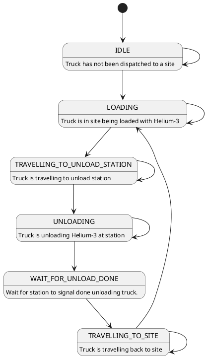
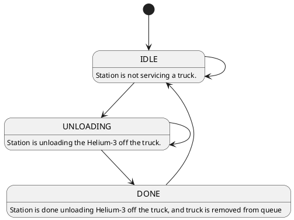

# VastTakeHomeChallenge
Vast Take-Home Coding Excercise March 2024

# Development Environment

This application was developed on a Ubuntu 22.02 Parallels virtual machine.
using g++ 11.4.0.

# Compilation

To compile the code run the following:

`cd VastTakeHomeChallenge$`

`make clean; make`

# Run Application

To run the application using default number of trucks [5] and default number of stations [2], run the following:

`./vastChallenge`

# Exit Application

This application will exit on its own after simulated 72-hours (72 * 100ms = 7.2 sec)
or if user enters `Ctrl-C`.

# Architecture and Design

## Overview

This application is a multithreaded application  composed of `n` number of truck threads and `m` number of unload station thhreads.

Each station will have an associated queue where it will hold truck references ready to unload

## Truck

A truck (see `Truck::Truck` class) is an object thread with the following state machine executed in the thread loop:

##  Unloading Station

An unloading station (see `UnloadingStation::UnloadingStation` class) is an object thread with a reference to a queue.  Each thread loop executes the following state machine:

